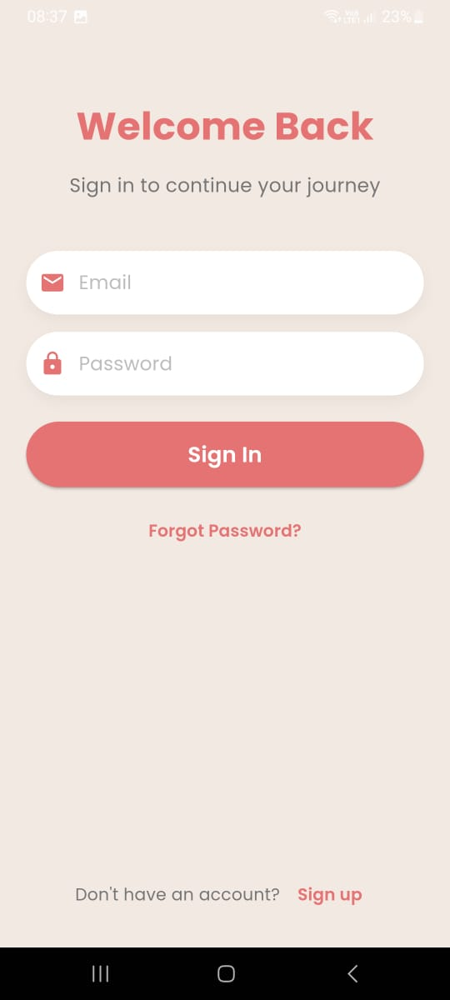
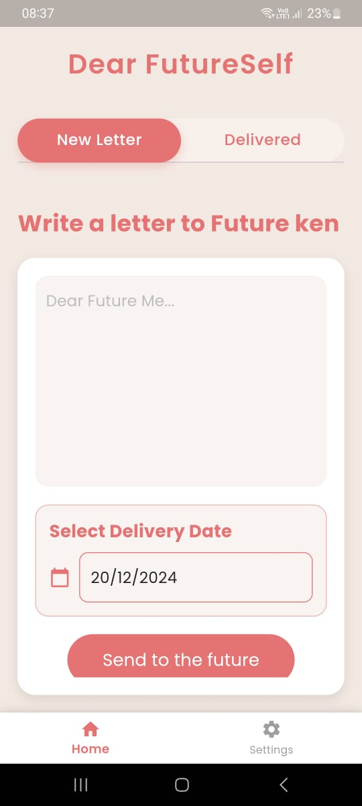
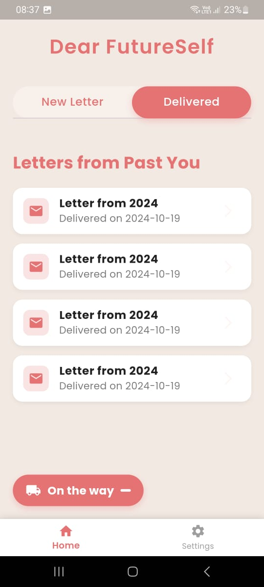
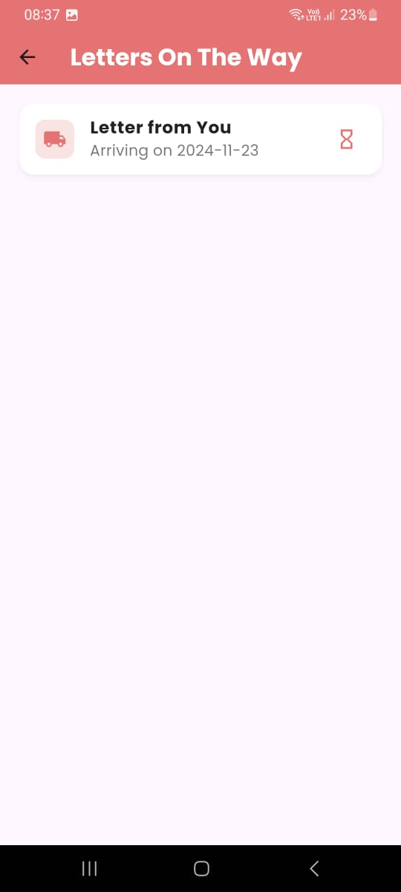
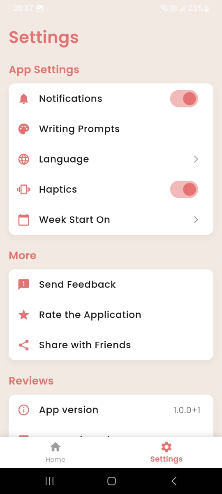

<div align="center">

# 🌟 FutureSelf

### Send Messages to Your Future Self

A beautifully crafted mobile application that lets you write letters to your future self, delivered exactly when you need them.

[Features](#-features) • [Installation](#-installation) • [Setup](#-setup) • [Contributing](#-contributing) • [License](#-license)


</div>

## 📱 Preview

<div align="center">
<table>
  <tr>
    <td>
      
    </td>
    <td>
      
    </td>
    <td>
      
    </td>
    <td>
      
    </td>
    <td>
      
    </td>
  </tr>
  <tr>
    <td align="center">
      <strong>Sign In</strong>
    </td>
    <td align="center">
      <strong>Home</strong>
    </td>
    <td align="center">
      <strong>Delivered</strong>
    </td>
    <td align="center">
      <strong>On the Way</strong>
    </td>
    <td align="center">
      <strong>Settings</strong>
    </td>
  </tr>
</table>
</div>

## ✨ Features

<table>
  <tr>
    <td>
      <h3>📝 Letter Writing</h3>
      Compose heartfelt messages to your future self with our intuitive editor
    </td>
    <td>
      <h3>🔔 Smart Notifications</h3>
      Receive your letters exactly when you need them through Firebase
    </td>
  </tr>
  <tr>
    <td>
      <h3>🔒 Secure Authentication</h3>
      Your messages are protected with Firebase Authentication
    </td>
    <td>
      <h3>☁️ Cloud Storage</h3>
      Never lose a letter with Firestore cloud storage
    </td>
  </tr>
</table>

## 🚀 Installation

1. **Clone the Repository**

   ```bash
   git clone https://github.com/atahtee/futureself.git
   cd futureself
   ```

2. **Install Dependencies**

   ```bash
   flutter pub get
   ```

3. **Firebase Setup**

   - Create a project in [Firebase Console](https://console.firebase.google.com/)
   - Add platforms (Android/iOS)
   - Download config files:
     - `google-services.json` → `android/app/`
     - `GoogleService-Info.plist` → `ios/Runner/`

4. **Run the App**
   ```bash
   flutter run
   ```

## 🛠️ Building for Production

### Android

1. **Generate Keystore**

   ```bash
   keytool -genkey -v -keystore upload-keystore.jks \
           -keyalg RSA \
           -keysize 2048 \
           -validity 10000 \
           -alias upload
   ```

2. **Configure Keystore**

   Create `android/key.properties`:

   ```properties
   storePassword=your-password
   keyPassword=your-key-password
   keyAlias=upload
   storeFile=upload-keystore.jks
   ```

3. **Build**
   ```bash
   flutter build apk --release
   # or
   flutter build appbundle --release
   ```

### iOS

1. **Setup Signing**

   ```bash
   open ios/Runner.xcworkspace
   ```

   Configure signing in Xcode

2. **Build**
   ```bash
   flutter build ios --release
   ```

## 👥 Contributing

We welcome contributions! Here's how you can help:

1. Fork the repository
2. Create your feature branch (`git checkout -b feature/AmazingFeature`)
3. Commit changes (`git commit -m 'Add AmazingFeature'`)
4. Push to branch (`git push origin feature/AmazingFeature`)
5. Open a Pull Request

## 📄 License

Distributed under the MIT License. See `LICENSE` for more information.

## 📬 Contact

Atif Aslam - [@atatisam14](https://twitter.com/atatwts)

Project Link: [https://github.com/atahtee/futureself](https://github.com/atahtee/futureself)

---

<div align="center">

Made with ❤️ by atati

</div>
